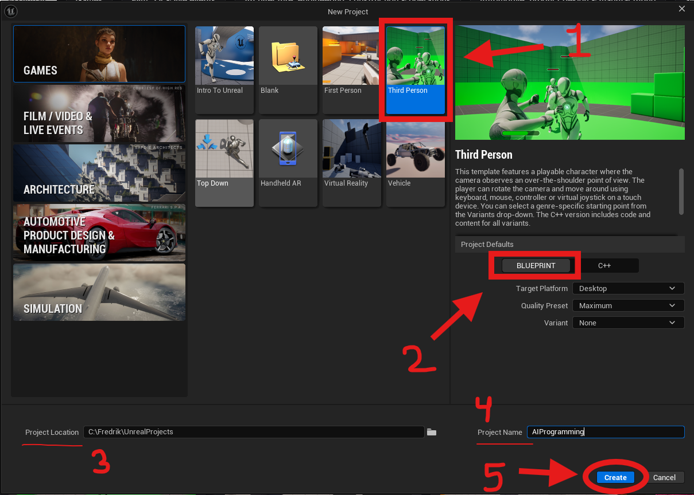
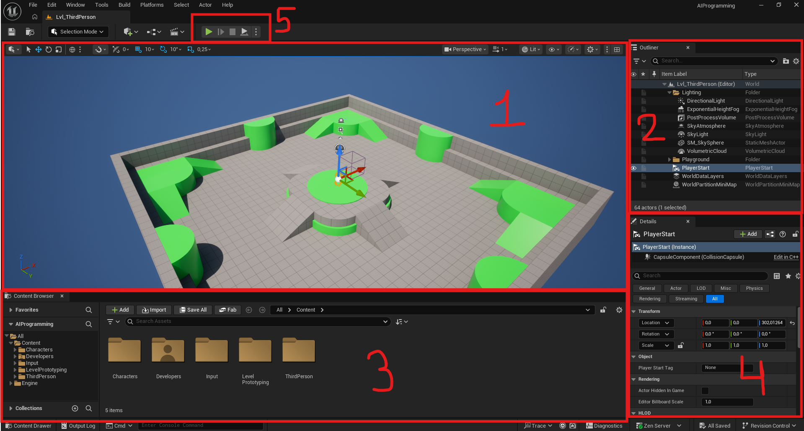
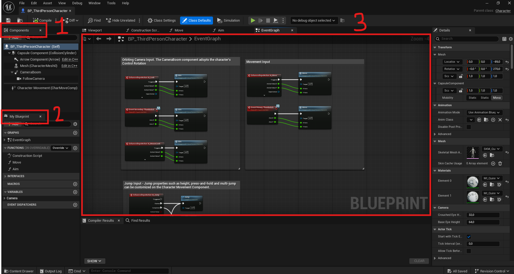
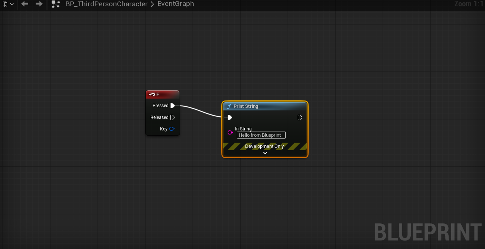
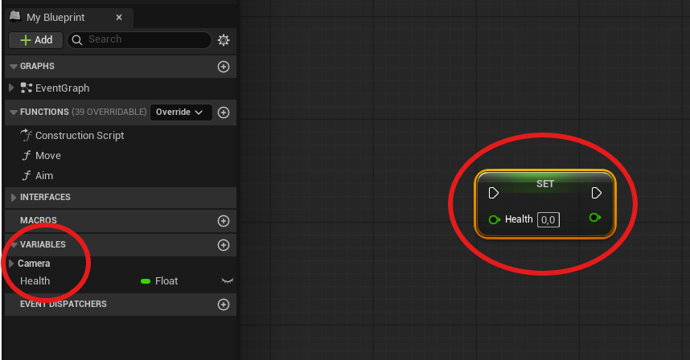
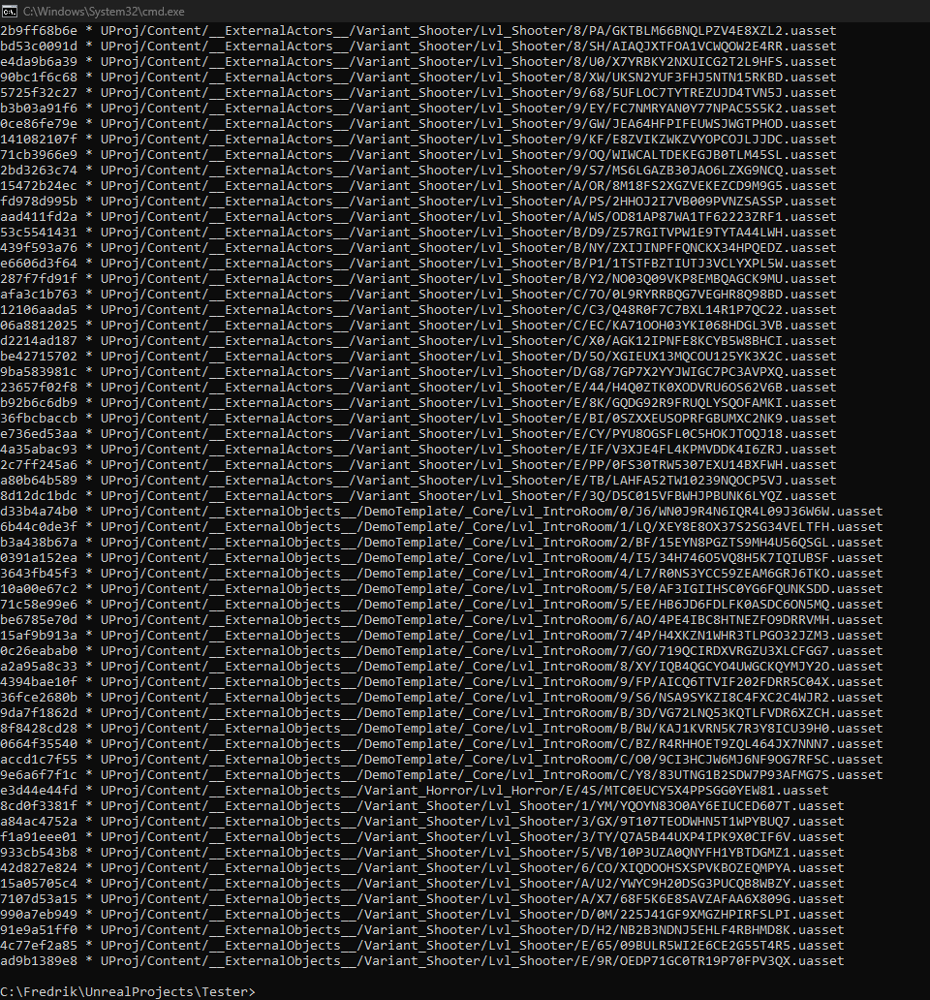

# 01 - Unreal Engine Editor, Blueprints, and Source Control

Welcome to the AI Programming course. Over the next three weeks you will build a demo scene in Unreal Engine 5 where multiple AI agents navigate a level, react to a player character, and interact with each other using industry-standard AI systems.

Today covers three things: getting comfortable in the Unreal editor, writing your first Blueprint logic, and setting up the GitHub repository that will hold your project for the rest of the course.

> **Warning**: Before you go ahead and create a project, make sure you activate Git LFS on the repository, please read the Git LFS section in this doc first.

[Click to jump to Git LFS section](#setting-up-git-lfs-for-unreal)

---

## The Unreal Editor

### First launch

When you open Unreal Engine 5 for the first time, the Epic Games Launcher prompts you to select a project template. Choose **Third Person**. This template provides a working player character, a basic level, and all the input bindings already configured. You will spend the course building AI around this character rather than building the character itself.



Set your project name and choose a folder on a drive with sufficient space. A fresh Unreal project with Starter Content is around 1.5 GB before you add anything.

When the editor opens you will see five main areas. Take a moment to identify each one before touching anything.



1. **Viewport** - the 3D view of your level. Middle mouse button pans, right mouse button held down lets you look around, WASD while holding right mouse moves the camera. The viewport is not a game window - pressing Play is the only way to run the game.

2. **Outliner** - the list of every Actor currently placed in the level. An Actor is any object that exists in the world. Every light, mesh, trigger volume, and AI character is an Actor.

3. **Content Browser** - your project's file system. Assets live here: Blueprints, meshes, materials, textures, sounds, and data assets. Right-click to create new assets, drag them into the viewport to place them.

4. **Details panel** - shows the properties of whatever is currently selected. Select an Actor in the viewport or Outliner and its components and variables appear here.

5. **Toolbar** - contains Play, Save, Build, and the source control status indicator.

### Actors and Components

Everything in an Unreal level is an Actor and an Actor already has a Transform (position, rotation, scale) built in. You then compose the Actor from components similar as you would in Unity.

Open the Outliner and click on `BP_ThirdPersonCharacter`. The Details panel shows its component hierarchy. You will see a `CapsuleComponent` (collision), a `Mesh` (the visual body), a `SpringArm` (the camera boom), a `Camera`, and a `CharacterMovement` component. Each component has its own properties and can have its own Blueprint logic.

This component model is identical in concept to Unity, just named differently:

| Unity | Unreal |
|---|---|
| GameObject | Actor |
| MonoBehaviour (script) | Blueprint (Event Graph) |
| Transform | SceneComponent (built into Actor) |
| Project window | Content Browser |
| Inspector | Details panel |
| Hierarchy | Outliner |

### Viewport navigation

Practice this before moving on. Efficient viewport navigation is not optional: if moving around the editor is slow, everything else is slower.

| Action                     | Control                              |
|----------------------------|--------------------------------------|
| Look around                | Right mouse button held + move mouse |
| Fly forward/back/left/right | Right mouse held + WASD              |
| Fly up/down                | Right mouse held + E / Q             |
| Pan                        | Middle mouse button + drag           |
| Zoom                       | Scroll wheel                         |
| Focus on selected object   | F                                    |
| Toggle perspective         | Alt + G                              |

---

## Blueprints

Blueprints are Unreal's visual scripting system. They compile to bytecode and run at runtime. They are not slower than C++ for most game logic: the performance difference only becomes relevant for hot inner loops like physics or heavy math.

A Blueprint is an asset. It has a class hierarchy (it extends another class), variables, functions, and an Event Graph. The Event Graph is where you add nodes and connect them with wires.

### Opening a Blueprint

In the Content Browser, navigate to `Content > ThirdPerson > Blueprints`. Double-click `BP_ThirdPersonCharacter` to open it in the Blueprint editor:



The Blueprint editor has its own panels:

1. **Components** - the component hierarchy for this Actor, same as the Details panel in the editor.

2. **My Blueprint** - lists all variables, functions, macros, and event dispatchers defined in this Blueprint.

3. **Event Graph** - the visual scripting canvas. Nodes connect left to right. Execution flows along white wires (exec pins). Data flows along colored wires (data pins).

### Your first Blueprint logic

You will add a simple debug print that fires when you press a key. This is the "Hello World" of Blueprints.

Right-click anywhere on the Event Graph canvas. A search box appears. Type `keyboard` and select `Keyboard Events > F`. This creates an `InputAction F` node with a `Pressed` exec pin.

Right-click again, search for `print string` and select it. Drag the white `Pressed` exec pin from the keyboard node to the white exec input on the Print String node. In the Details panel (or directly on the node) change the string to `"Hello from Blueprint"`.



Press **Compile** in the Blueprint toolbar (yellow indicates un-compiled data). The compile button turns green. Press **Play** in the main editor toolbar. Press F. The string appears in the top-left corner of the game view.

This is the fundamental loop of blueprints: add nodes, connect exec pins to define order, connect data pins to pass values, compile, play.

### Variables

Variables store data. In the My Blueprint panel, click the `+` button next to Variables. Name it `Health` and set its type to `Float` in the Details panel. Press compile first and then set the default value to `100.0` in the details panel.

To read a variable in the graph: drag it from the My Blueprint panel into the graph and let go: an option to select between `Set` and `Get` appears.



### Casting

Unreal is strongly typed. When a function returns an `Actor` reference but you need to call a function specific to `BP_ThirdPersonCharacter`, you must cast. The `Cast To BP_ThirdPersonCharacter` node takes an Actor input and outputs a reference to the specific class if the cast succeeds. If the Actor is not of that type, the Cast Failed exec pin fires instead.

You will use casting constantly when the AI needs to interact with the player character.

---

## Source Control Setup

### Why Git LFS is necessary for Unreal projects

Unreal Engine projects contain binary files - `.uasset` and `.umap` files. These are not text. Git stores file history by computing diffs between versions. Binary files produce enormous diffs that cannot be meaningfully compressed or delta-encoded. A project with fifty assets and ten commits can grow to hundreds of megabytes in the `.git` folder even though the working directory is small.

Git Large File Storage (LFS) solves this by storing binary files on a separate server and replacing them in the repository with small text pointer files. The repository stays fast. The actual binary content is fetched on checkout.

### Perforce - a brief aside

Before setting up Git, it is worth knowing why the games industry often uses something different.

Perforce Helix Core is the version control system used by most large game studios - Epic Games, Ubisoft, EA, Naughty Dog. Unreal Engine has native Perforce integration built into the editor. You can check files in and out, view history, and submit changelists without leaving Unreal.

The key difference from Git is **exclusive checkout** (also called file locking). In Perforce, when you check out a binary asset to edit it, the server marks it as locked. No one else can edit it until you submit your changes. This prevents the situation Git LFS cannot solve: two people editing the same `.uasset` file and producing an unresolvable binary conflict.

For a solo project, this distinction does not matter. For a team of twenty artists all working on the same project, exclusive checkout is essential. When you join a studio and sit down at a Perforce workstation, the concepts are: depot (the remote repository), workspace (your local copy), changelist (a staged set of changes, equivalent to a Git commit), and submit (pushing a changelist to the server).

For this course, Git with LFS is the right choice. You already know Git, the setup is free, and your projects are solo.

### Setting up Git LFS for Unreal

> **Do this before creating your Unreal project.**
>
> LFS must be configured before any binary files are committed. If you create the Unreal project first, open the editor, and then try to add LFS later, you will already have `.uasset` files in Git's regular history. Migrating them out requires rewriting the entire commit history, which is error-prone and time-consuming. The correct order is: repository first, LFS configured, then create the Unreal project inside it.

**Step 1: Install Git LFS**

Download and install Git LFS from [git-lfs.github.com](https://git-lfs.github.com) if it is not already installed. Verify installation:

```bash
git lfs version
```

You should see output like `git-lfs/3.x.x`.

**Step 2: Create your GitHub repository**

Create a new empty repository on GitHub. Do not add a README or `.gitignore` from the GitHub UI — you will create these yourself.

**Step 3: Initialise the local repository and activate LFS**

Create the folder where your Unreal project will live, open a terminal inside it, and run:

```bash
git init
git lfs install
```

`git lfs install` activates LFS for this repository and adds the LFS hooks. Do this now, before Unreal has created any files. Only after this step should you create the Unreal project inside this folder.

**Step 4: Create the `.gitignore`**

Create a file named `.gitignore` in the project root with the following content:

> An alternate easy way to create it in the command prompt window is to write: `echo > .gitignore`, for mac you can use the `touch` command.

Then edit the file with a text editor (notepad), VS or Rider.

```
# Unreal build output
[UNREAL_PROJECT_FOLDER]/Binaries/
[UNREAL_PROJECT_FOLDER]/Build/
[UNREAL_PROJECT_FOLDER]/Intermediate/
[UNREAL_PROJECT_FOLDER]/Saved/
[UNREAL_PROJECT_FOLDER]/DerivedDataCache/
[UNREAL_PROJECT_FOLDER]/FileOpenOrder/

# Visual Studio
.vs/
*.user
*.suo

# Compiled files
*.pdb
*.exp
*.lib

# Exclude packaged builds
*.pak
*.sig
```

The key directories to exclude are `Binaries/`, `Intermediate/`, and `Saved/`. These are regenerated by the engine and can be hundreds of megabytes. `DerivedDataCache/` is a local cache that should never be committed.

**Step 5: Create the `.gitattributes` file**

Create a file named `.gitattributes` in the project root:

```
# Unreal binary assets - track with LFS
*.uasset filter=lfs diff=lfs merge=lfs -text
*.umap filter=lfs diff=lfs merge=lfs -text
*.udk filter=lfs diff=lfs merge=lfs -text

# Other binary formats
*.png filter=lfs diff=lfs merge=lfs -text
*.jpg filter=lfs diff=lfs merge=lfs -text
*.jpeg filter=lfs diff=lfs merge=lfs -text
*.bmp filter=lfs diff=lfs merge=lfs -text
*.tga filter=lfs diff=lfs merge=lfs -text
*.psd filter=lfs diff=lfs merge=lfs -text
*.wav filter=lfs diff=lfs merge=lfs -text
*.mp3 filter=lfs diff=lfs merge=lfs -text
*.ogg filter=lfs diff=lfs merge=lfs -text
*.fbx filter=lfs diff=lfs merge=lfs -text
*.obj filter=lfs diff=lfs merge=lfs -text
*.ttf filter=lfs diff=lfs merge=lfs -text
*.otf filter=lfs diff=lfs merge=lfs -text
*.pdf filter=lfs diff=lfs merge=lfs -text
*.zip filter=lfs diff=lfs merge=lfs -text

# Force text files to use LF line endings
*.ini text eol=lf
*.cfg text eol=lf
*.cs text eol=lf
*.cpp text eol=lf
*.h text eol=lf
```

**Step 6: First commit and push**

```bash
git add .gitignore
git add .gitattributes
git commit -m "Initial commit - add gitignore and gitattributes"
// Create your unreal project now
git add .
git commit -m "Add Unreal project"
git remote add origin https://github.com/YOUR_USERNAME/YOUR_REPO.git
git branch -M main
git push -u origin main
```

**Step 7: Verify LFS is tracking correctly**

```bash
git lfs ls-files
```

You should see your `.uasset` and `.umap` files listed with an `*` indicating they are tracked by LFS, not stored directly in Git.



### Verifying your setup

Open GitHub in a browser and navigate to your repository. Click on any `.uasset` file. Instead of binary garbage, you should see a small text file that looks like:

```
version https://git-lfs.github.com/spec/v1
oid sha256:4d7a...
size 123456
```

This is the LFS pointer. The actual binary data lives on the LFS server. This is correct behaviour.

### Ongoing workflow

From this point forward your Git workflow is unchanged from Unity projects:

```bash
git add .
git commit -m "Add patrol behaviour tree"
git push
```

LFS handles the binary files automatically. The only rule: never delete `.gitattributes`. If that file is lost, new binary files will be committed directly to Git instead of LFS and the repository will bloat rapidly.

A good commit cadence for this course is once per working session, at minimum once per day. Commit messages should describe what changed, not that you changed something. `"Add AIPerception to guard blueprint"` is useful. `"Update files"` is not.

---

## Assignment Introduction

Your assignment for this course is a demo scene with a player character and multiple AI agents. The game context is your choice - stealth, horror, action, strategy, anything works. The AI systems are the subject, not the genre.

The minimum requirements for a passing grade are covered in the grading document. Start thinking about your game context today so that the AI systems you build each day can serve a specific scenario rather than existing in isolation.

Your repository is your submission along with a video and README file. Keep it organised and commit regularly. The README you write is part of your grade.
