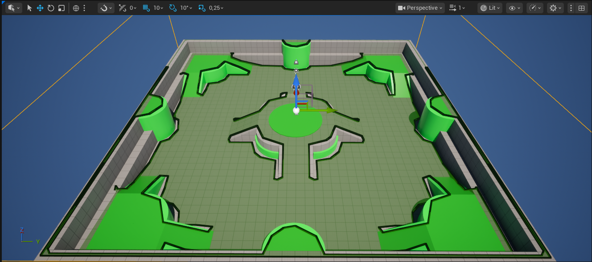
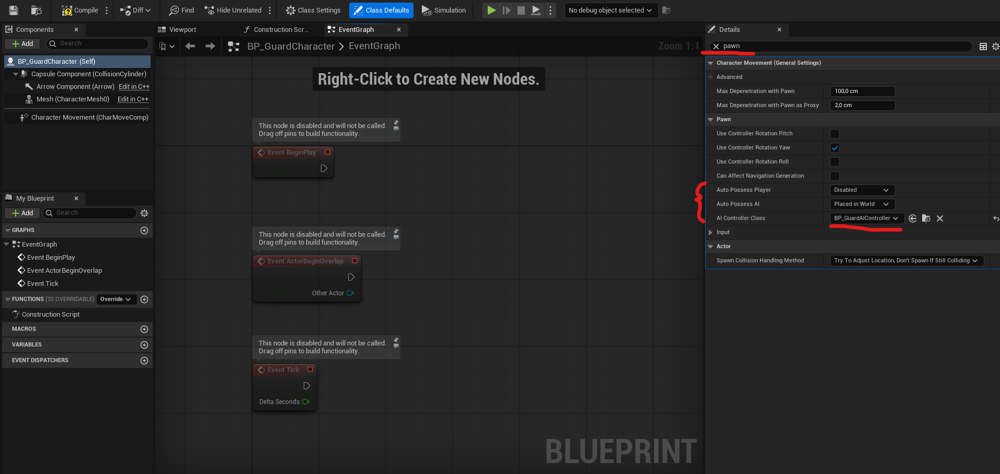
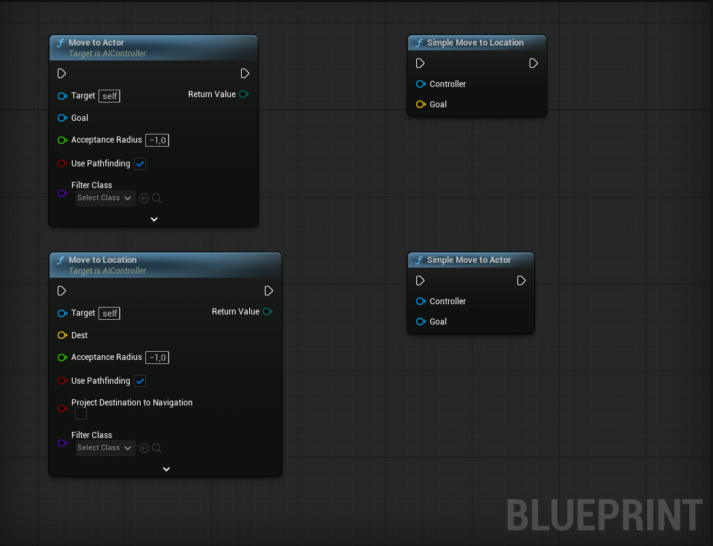
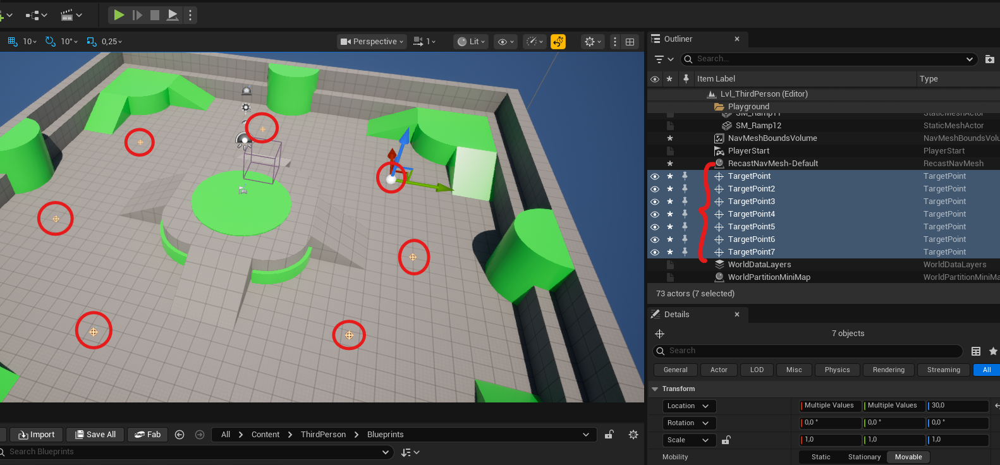
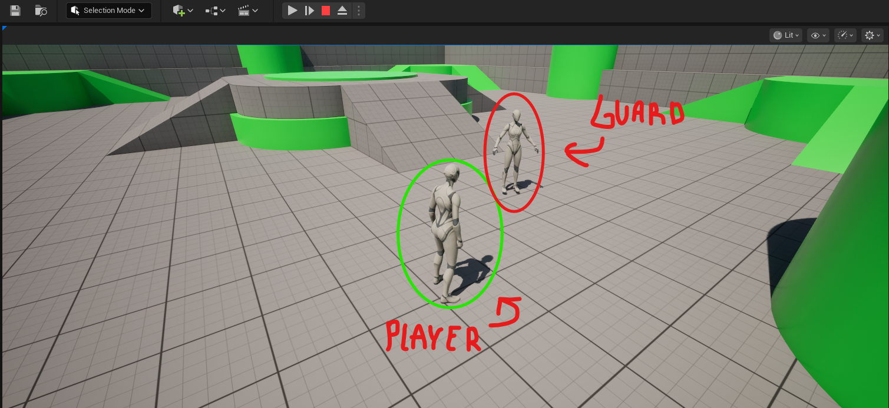

# 02 - Navigation Mesh and the AI Controller

Next we will set up the two systems that everything else in this course builds on: the Navigation Mesh that defines where agents can walk, and the AI Controller that drives a Pawn autonomously. By the end of the day your scene should have a player character and at least one AI agent moving purposefully through the level.

---

## The Navigation Mesh

### What it is

A Navigation Mesh (NavMesh) is a baked representation of all walkable surfaces in your level, stored as a graph of convex polygons. When an AI agent needs to move somewhere, Unreal runs A* on this polygon graph to find the cheapest path, then steers the agent along it.

If you completed the Algorithms and Data Structures course, you built this algorithm yourself. The NavMesh is the graph. A* finds the path. The agent then follows it using steering behaviour, adjusting its velocity each frame to stay on track.



One important property: the NavMesh is **baked at edit time** for static geometry. If you move a wall in the editor, you need to rebuild it. Dynamic obstacles like moving characters are handled separately by Unreal's avoidance system at runtime — the NavMesh itself does not update for them.

### How to set one up

The NavMesh is defined by a `NavMeshBoundsVolume` placed in the level. This volume tells Unreal which region of the level to analyse for walkable surfaces. Once you have placed and sized it, navigation data is built via **Build > Build Paths**.

You can toggle the NavMesh overlay in the viewport by pressing **P**. Use this constantly while building your level to verify that your agents will actually be able to reach where you want to send them.

A few things that commonly go wrong: the volume does not enclose the floor geometry, the floor has no collision, or the agent capsule height is larger than a gap in the geometry. The `RecastNavMesh-Default` actor that appears in the Outliner after building holds the configuration settings for agent size.

---

## The AI Controller

### The separation between Pawn and Controller

In Unreal, any character that can be controlled is called a Pawn. What drives the Pawn, what makes decisions for it, is a separate object called a Controller.

When a human plays, a Player Controller reads input and drives the Pawn. When an AI plays, an AI Controller makes autonomous decisions. The Pawn itself contains no logic about who is controlling it. It only knows how to move, play animations, and interact with the world. The Controller provides the intent.

This separation is deliberate and important. It means you can swap between player control and AI control without changing the Pawn. It also means your AI logic lives in one place, the Controller, not scattered across the character Blueprint.



### Setting up your AI character

You will need two Blueprint classes:

**A character Blueprint**: this is the Pawn. It represents the agent's physical presence in the world: its mesh, its capsule for collision, its movement component. It does not contain patrol logic or decision-making.

**An AI Controller Blueprint**: this is the brain. It possesses the Pawn when the game starts and drives all of its behaviour.

To connect them, open the character Blueprint and find the AI Controller Class setting in its Details panel under the Pawn category. Assign your controller there. Also set Auto Possess AI to Placed in World so the controller automatically takes over when the level loads.

The key event in the AI Controller is `Event On Possess`. This fires the moment the controller takes ownership of a Pawn. Anything the AI needs to initialise, starting a patrol, running a Behaviour Tree, setting up variables, goes here.

---

## Making an Agent Move

### The Move To family of nodes

Unreal provides several nodes for issuing movement commands to AI agents. The simplest is `Simple Move To Location`, which tells an agent to navigate to a world position in a single call. There is also `Move To Actor` and `Move To Location` in the AI Controller, which give you more control and fire completion events when the move finishes.

These nodes work by submitting a path request to the navigation system. The system runs A* on the NavMesh and returns a path. The agent then steers along it. If the destination is outside the NavMesh, the move fails silently.



### Building a patrol loop

A patrol system needs to know where to go and when to move to the next point. At its core it requires:

- A collection of waypoints defining the route
- A way to track which waypoint is current
- A way to trigger the next move when the current one finishes

A `Custom Event` in the AI Controller fires when a movement request ends, either successfully or because it was interrupted. This is the natural place to decide what to do next.

Think about how to structure this before you start. What data does the controller need to store? How do you know which point to move to? How do you loop back to the start after reaching the last point? How do you avoid the agent standing still permanently if a move fails?



### Waypoints in the level

`Target Point` actors are simple placeholder markers you can place anywhere in the level. They are useful as patrol waypoints because they have a location you can query and they are easy to move around in the editor.

How you store and access those waypoints in the controller is up to you. Think about what happens if you want to change the patrol route later, would your approach make that easy or hard?

---

## What to Have Working by End of Day

- A level with a NavMesh covering the walkable area
- A character Blueprint set up as your AI agent with a custom AI Controller assigned
- The agent moving between at least two waypoints in a loop
- The player character from the Third Person template coexisting in the same level

The agent does not need to react to the player yet. That comes next. Focus on getting autonomous movement solid first, everything later depends on it.



If the agent is not moving, press P and verify the NavMesh covers your waypoints. If a waypoint sits outside the green region, the move request will fail immediately without the agent leaving its starting position.

---

## Commit Your Work

```bash
git add .
git commit -m "Day 2 - NavMesh and AI controller with patrol movement"
git push
```

---

**Next** - Finite state machines, Blackboards, and Behaviour Trees. You will learn why Behaviour Trees exist, what problem they solve that simpler approaches cannot, and begin structuring your AI logic in a way that can grow without becoming unmanageable.