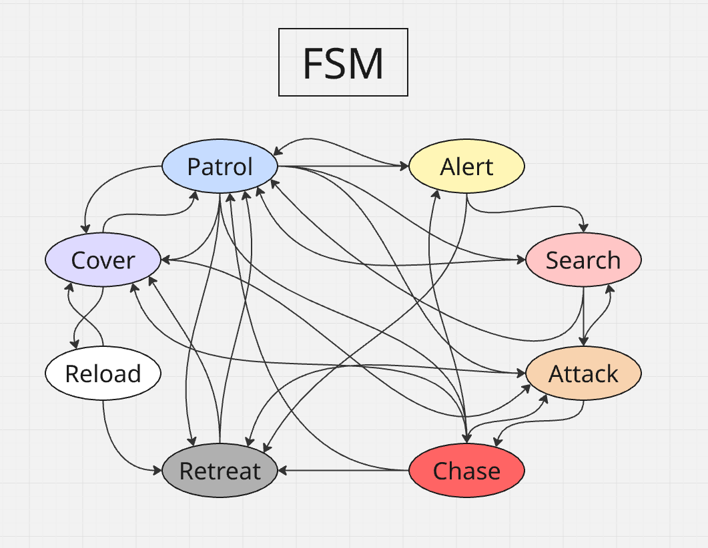
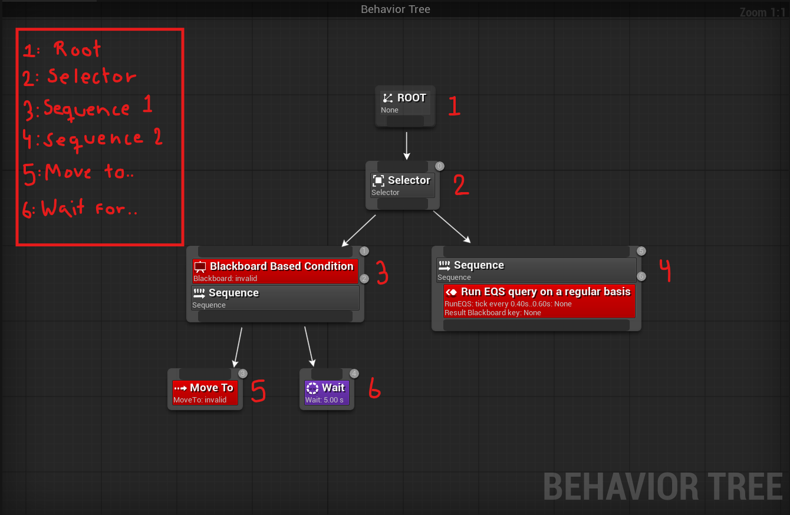
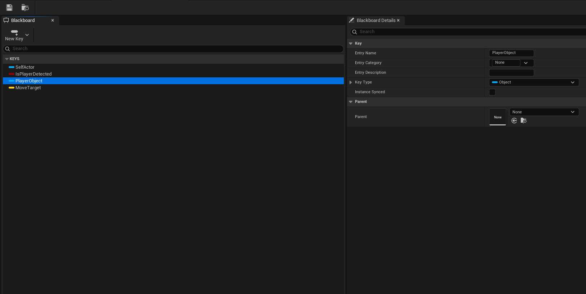
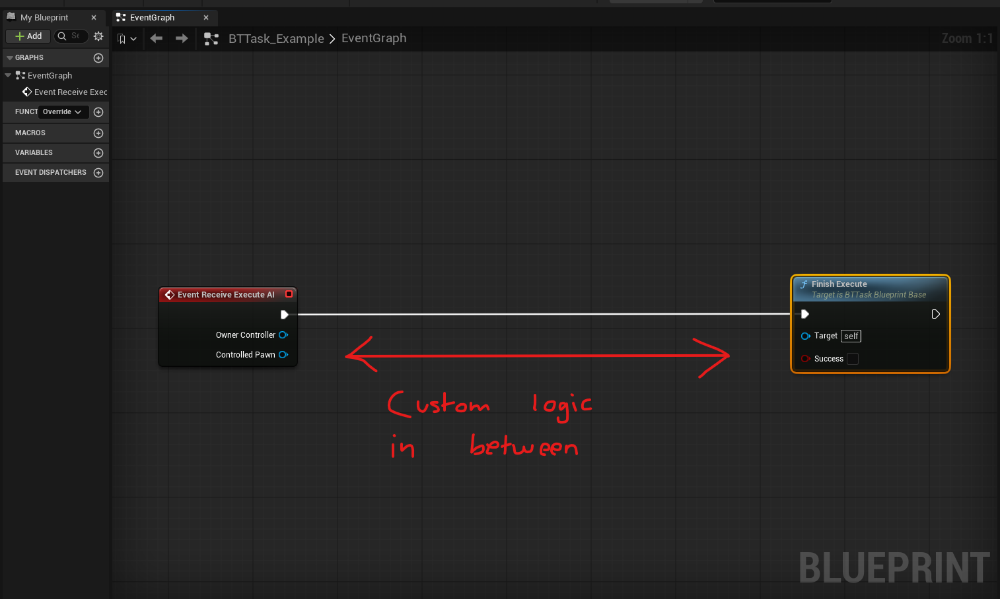
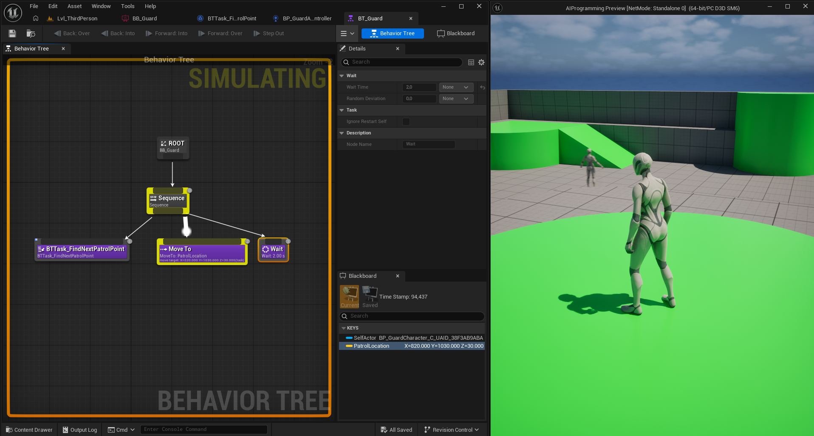
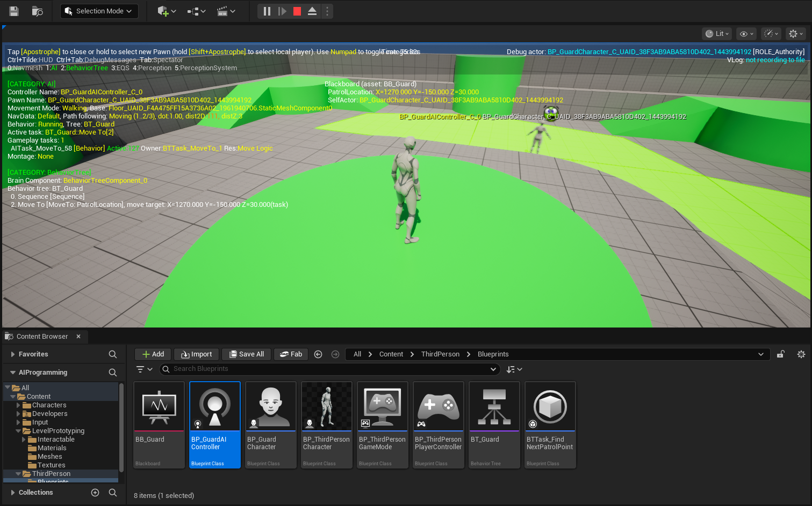

# 03 - Finite State Machines, Blackboards, and Behaviour Trees

Previously you built a patrolling agent using a Custom Event loop in the AI Controller: move to a point, wait, advance the index, call the event again. The patrol works. Today you learn why that approach has limits as behaviour grows more complex, and how Behaviour Trees solve those limits. By end of day you should have your patrol running inside a Behaviour Tree: the same visible result, but with an architecture that can grow without becoming unmanageable.

---

## Finite State Machines

### The intuition

A Finite State Machine (FSM) is the oldest model for game AI. The agent exists in exactly one state at a time. Conditions trigger transitions between states. Each state defines what the agent does while it is active.

A simple enemy might look like this:

```
[Patrol] ---player spotted---> [Chase]
[Chase]  ---player lost------> [Search]
[Search] ---timeout----------> [Patrol]
[Chase]  ---close enough-----> [Attack]
[Attack] ---player fled------> [Chase]
```

Five states. Seven transitions. It is readable, debuggable, and easy to reason about. If the enemy does something unexpected you check which state it is in and which transition fired.

### Where FSMs break down

The problem appears as the AI grows. Add five more states: cover, suppressed, flanking, reloading, calling for backup. Now count the potential transitions.

With 10 states there are up to 90 possible transitions between them. With 20 states: 380. Most will never fire, but you still have to reason about all of them. You have to ensure that `Reloading` cannot accidentally transition to `Calling for backup`. The complexity grows with the square of the number of states.

FSMs are still the right tool for simple agents, UI state, and animation logic. But for complex enemy AI with many competing priorities, managing all those transitions becomes unsustainable.



---

## Behaviour Trees

### The key idea

A Behaviour Tree replaces explicit transitions with implicit priority. There are no arrows between states. Instead, the tree is evaluated from the root and executes the highest-priority branch whose conditions are currently satisfied.

The priority is encoded in the tree's structure: branches on the left run before branches on the right. The tree re-evaluates automatically when conditions change, and a higher-priority branch can interrupt whatever is currently running.

Adding a new behaviour means adding a new branch at the right position in the tree. Nothing else changes. This is the property that makes Behaviour Trees scale where FSMs do not.

### Node types

There are four kinds of nodes you will work with:

**Composite nodes** control execution flow. A `Selector` tries its children from left to right and stops at the first one that succeeds: use this for "try A, if that fails try B". A `Sequence` runs its children in order and stops at the first failure: use this for "do A, then B, then C".

**Task nodes** are leaves that do actual work: move to a location, wait, play an animation. A task runs until it reports success or failure.

**Decorator nodes** are conditions attached to any node. If the condition is false, the node is skipped entirely. Decorators can also observe Blackboard values and abort the current task the moment a condition changes: this is what makes a higher-priority branch interrupt a lower-priority one instantly.

**Service nodes** run on a timer while their branch is active. They are used for polling: checking whether the player is visible, updating target positions, querying game state. They write their results to the Blackboard.



### How evaluation works

The tree does not run every node every frame. It picks the active leaf task and runs it frame by frame until that task completes. When a task completes, the tree re-evaluates from the root to find the next task to run.

Decorators set to observe their conditions interrupt this process. If a decorator's condition changes while a task is running: say a `CanSeePlayer` bool switches to true: the decorator can immediately abort the current task and force re-evaluation. This is how reactive behaviour works without polling.

---

## The Blackboard

### What it is

The Blackboard is a shared data store: a key-value map that the AI Controller, the Behaviour Tree, its tasks, and its services all read and write. Think of it as the agent's working memory.

The Behaviour Tree does not query the world directly. It does not check line-of-sight or measure distances itself. Those checks happen in Services, which write their results to the Blackboard. The tree reads the Blackboard to make decisions.

This separation keeps the tree clean: it is a decision-maker, not a sensor. The Blackboard is the interface between sensing the world and deciding what to do about it.

### What keys you will need

Before building the tree, think about what information your agent needs to store. For a patrol agent that will eventually react to the player, consider what data it needs to:

- Know where to walk next on its patrol route
- Know whether the player has been detected
- Know where the player was last seen

These become Blackboard keys. You create the Blackboard asset first, define the keys and their types, and then wire the tree to read and write those keys through tasks, services, and decorators.



---

## Building the Patrol Tree

### The structure to aim for

Your patrol behaviour needs to do three things in sequence: decide where to go next, move there, and wait briefly before repeating. This maps naturally onto a Behaviour Tree structure: you are doing things in order, so a Sequence is the right composite.

Think about what each step needs:

- Deciding the next waypoint requires reading from your patrol points array and writing a destination to the Blackboard
- Moving there is a built-in task that reads a location from the Blackboard
- Waiting is a built-in task with a configurable duration

When the Sequence completes, the root re-evaluates and runs the Sequence again from the beginning. That is your patrol loop.

### Custom tasks

The step that picks the next waypoint does not exist as a built-in node: you need to create a custom Task Blueprint. There is no dedicated shortcut for this in the Content Browser right-click menu. Instead, right-click and choose Blueprint Class, then search for `BTTask_BlueprintBase` in the class picker and select it. This is your task's parent class. Name it something descriptive like `BTTask_FindNextPatrolPoint`.

A Behaviour Tree Task Blueprint inherits from `BTTask_BlueprintBase` and implements the `Event Receive Execute AI` event.

The critical rule: every custom task must call `Finish Execute` before it returns. If it never calls `Finish Execute`, the tree hangs permanently on that task. The node takes a boolean indicating success or failure: a task that fails causes its parent Sequence to fail, which triggers the tree to try other branches.

Inside the task you have access to the Controlled Pawn and the Owner Controller. From the Owner Controller you can reach any data stored on the controller itself. You can also read and write Blackboard values directly using the `Get/Set Blackboard Value` family of nodes.



### Connecting the tree to the controller

Once the tree asset exists, the AI Controller needs to run it. The `Run Behavior Tree` node in the `Event On Possess` handler starts the tree when the agent spawns. The tree then drives all movement: you no longer need the direct move calls you wrote previously.

When the tree is running you can select the agent in the Outliner during Play and watch the Behaviour Tree editor highlight the currently active node in yellow. The Blackboard panel shows all key values updating in real time. This debugger is your primary tool for understanding why an agent does or does not do what you expect.



Press the apostrophe key (**'**) during Play for the AI debug overlay in the viewport, which shows navigation paths, perception cones, and current state for every agent.



---

## What to Have Working by End of Day

- A Blackboard asset with the keys your patrol agent needs
- A Behaviour Tree with at least a working patrol loop driven by a custom task
- The AI Controller running the tree rather than the direct move calls from yesterday
- The patrol behaving identically to yesterday: same movement, different architecture

The tree can be simple for now. One sequence, one custom task, one Move To, one Wait. The point is that it runs and the debugger shows it ticking correctly. Everything built later: perception, chase, investigate: will be added as new branches above this one.

---

## Commit Your Work

```bash
git add .
git commit -m "Day 3 - Blackboard and Behaviour Tree driving patrol"
git push
```