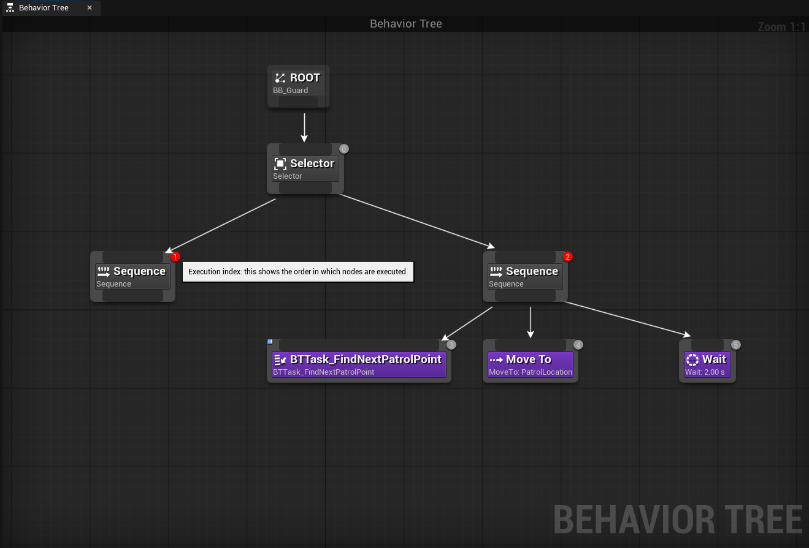
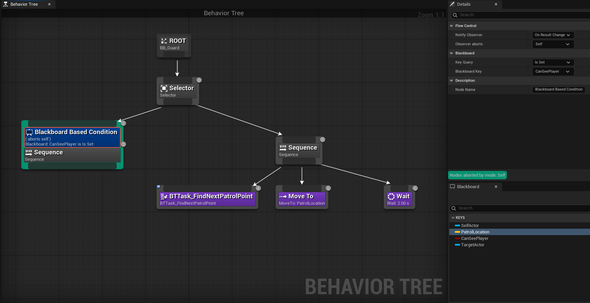
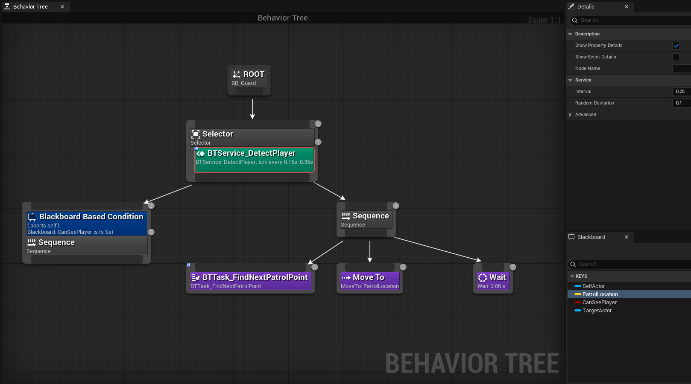

# 04 - Decorators, Services, and the Chase Branch

Your patrol agent moves autonomously and is driven by a Behaviour Tree. That is the foundation. Now the agent needs to do more than one thing: it should patrol by default, but switch to a different behaviour when something relevant happens. This session introduces the two tools that make a Behaviour Tree reactive: Decorators and Services.

---

## The Problem with One Sequence

The tree you built has a single Sequence under the Root. It loops: find a point, move there, wait, repeat. This works perfectly for patrol. But consider what happens when you want to add a chase behaviour.

You could add a Branch node inside the FindNextPatrolPoint task, checking whether the player is visible. If visible, go toward the player instead. If not, go toward the next waypoint. This works until you add a third behaviour. Then a fourth. Every new behaviour gets woven into the existing logic, and the complexity compounds.

The Behaviour Tree solves this by encoding priority in its structure rather than in code. Multiple behaviours live as separate branches. The tree evaluates them in order, runs the first one whose conditions are met, and automatically interrupts it when a higher-priority branch becomes available.

That requires two new concepts: a **Selector** composite, and **Decorators**.

---

## The Selector Composite

You already know the Sequence: run children left to right, stop at the first failure. The Selector is the inverse: run children left to right, stop at the first success.

A Selector at the root of your tree means: try the leftmost branch. If it succeeds (or is running), stop there. If it fails, move to the next branch. The leftmost branch has the highest priority.

This is how multiple behaviours coexist without transition code:

```
Selector
  Sequence [Chase]   <- tried first
  Sequence [Patrol]  <- tried only if Chase does not run
```

If the Chase Sequence is blocked by a condition, the Selector moves to Patrol. If Chase becomes possible mid-patrol, it can interrupt Patrol immediately. No transitions. The structure is the logic.



---

## Decorators

A Decorator is a condition node attached to any Sequence, Selector, or Task. It does two things:

**Gates entry.** If the Decorator's condition is false, the node it is attached to is never entered. The Selector moves past it as if it failed.

**Observes and aborts.** If the Decorator is configured to observe its condition, it watches the Blackboard constantly while its node is running. The moment the condition changes, it can abort the running node immediately and force the tree to re-evaluate from the root.

The most commonly used Decorator is the **Blackboard Decorator**. It checks a Blackboard key against a condition: is this Boolean true? Is this Object set? Is this value above a threshold?

The **Observer Abort** setting controls what gets aborted when the condition changes:

- **Self**: abort only this branch
- **Lower Priority**: abort branches to the right of this one in the parent Selector
- **Both**: abort both

For a Chase branch that should interrupt Patrol when the player is spotted, Self is the correct setting. The Chase branch aborts itself when sight is lost. Patrol is not explicitly interrupted: it simply becomes the active branch again when the Selector re-evaluates.

### Adding a Decorator to a node

Right-click on any composite or task node in the Behaviour Tree editor and choose **Add Decorator**. The Decorator appears as a small node attached above the node it belongs to. Select it to configure it in the Details panel.



---

## Services

The Behaviour Tree does not query the world directly. It does not check line of sight or measure distances. Those checks happen in Services, which write their results to the Blackboard. The tree reads the Blackboard to make decisions.

A **Service** is a Blueprint that runs on a configurable timer while its parent branch is active. Attach a service to the root Selector and it runs constantly. Attach it to the Chase Sequence and it only runs while chase is active.

Services inherit from `BTService_BlueprintBase`. The key event is **Event Receive Tick AI**, which fires on the configured interval. From here you can query the world, measure distances, perform line traces, and write the results to Blackboard keys using the **Set Blackboard Value** family of nodes.

The Blackboard keys your Decorators check must be kept up to date by Services (or by the AI Controller's perception event, which you will set up next session). A Decorator watching a key that never changes is a gate that never opens.

### Service tick interval

Set the Interval in the Details panel of the service node after attaching it to the tree. A value of 0 runs every frame, which is expensive. Values between 0.1 and 0.5 are typical. The right interval depends on how quickly the relevant game state changes: perception checks can often run at 0.25 seconds without the agent feeling sluggish.

### Attaching a service to the tree

Right-click any composite node and choose **Add Service**. The service appears as a small node attached below the composite. Select it to set the interval and any configuration properties.



---

## What the Chase Branch Needs

To implement a Chase branch that interrupts Patrol when the player is detected, you need:

**A Blackboard key** representing whether the player is detected. A Boolean works. So does an Object key: if the key holds a valid actor reference, the player is known; if it is null, they are not.

**A Service** that runs continuously and writes to that key. For now, a distance check is a reasonable starting point: if the player is within a configurable range, write true; otherwise write false. Next session this gets replaced with the proper AIPerception component.

**A Decorator** on the Chase Sequence checking that key, with Observer Abort set to Self.

**A Move To task** in the Chase Sequence targeting the player. The Move To node can follow an Actor reference directly: write the player actor to a Blackboard key and set that key as the Move To's target.

Think about what other tasks belong in the Chase Sequence. What should the agent do when it reaches the player? What should happen if it loses sight mid-chase?

---

## What to Have Working After This Session

- The tree restructured with a Selector at the root
- A Chase Sequence as the left branch with a Blackboard Decorator
- A Service attached to the Selector updating the detection key
- The agent switching from Patrol to Chase when the detection condition is met, and returning to Patrol when it is not

The detection logic does not need to be sophisticated yet. A distance check is enough to verify the tree structure works. The perception system comes next session.

---

## Don't forget: Commit Your Work

```bash
git add .
git commit -m "04 - Decorators, service, and chase branch"
git push
```