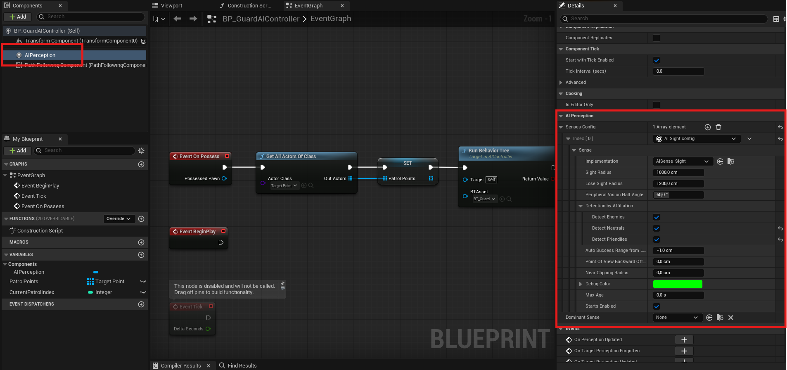
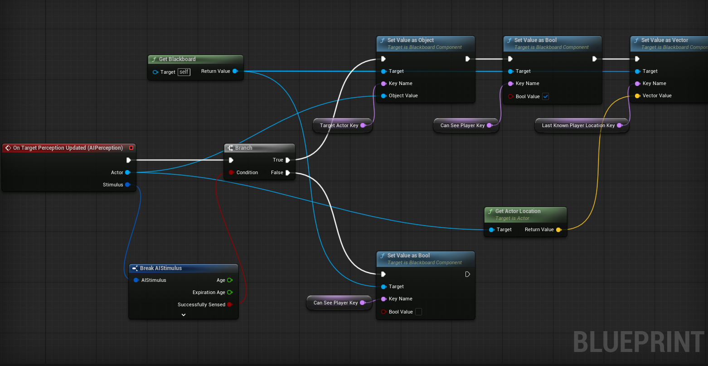
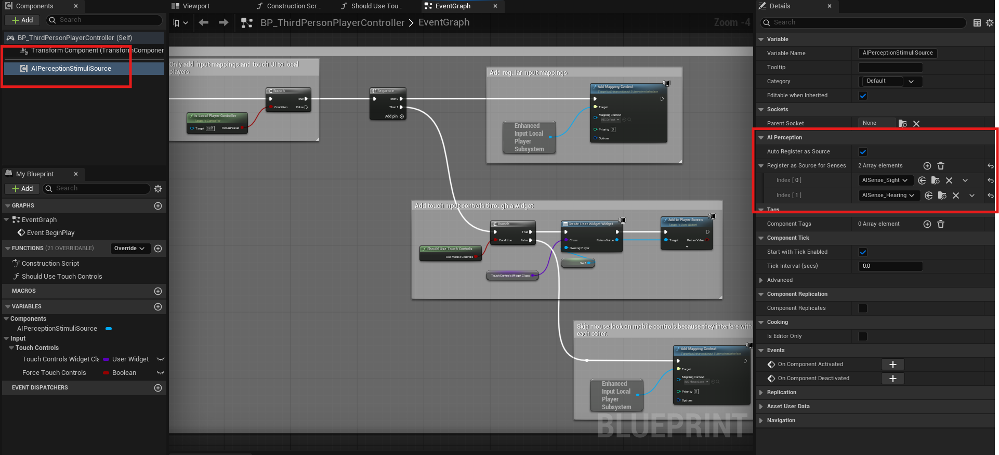
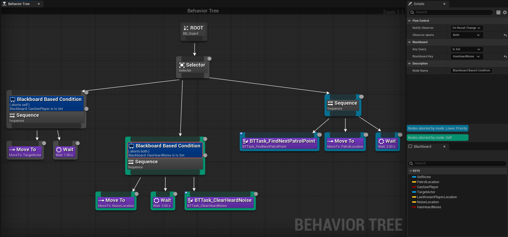
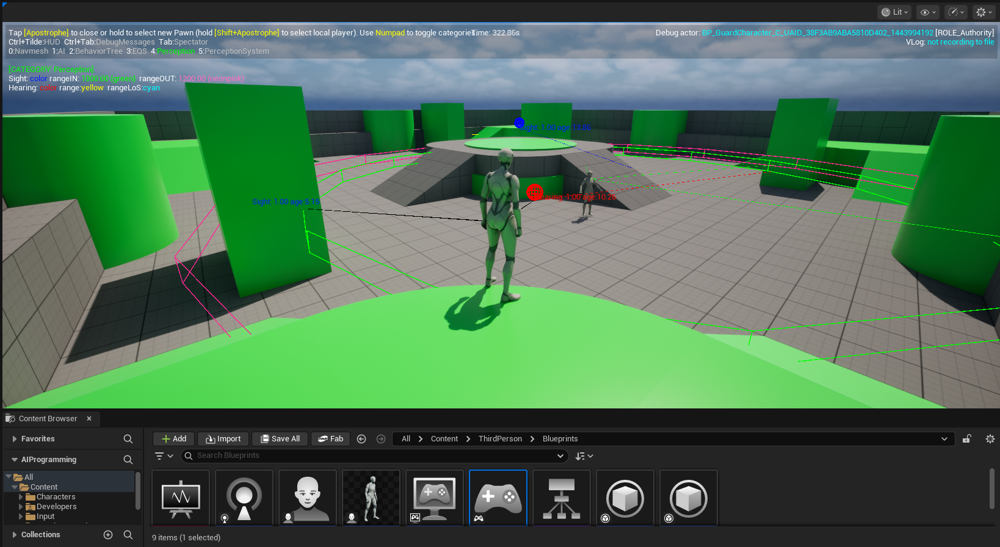

# 05 - AIPerception: Sight and Hearing

The distance check from last session detects the player through walls, in all directions, at a fixed radius. It is useful for testing tree structure, but it is not how a game AI should work. This session replaces it with Unreal's AIPerception system: a configurable, managed perception layer with proper sight cones, line-of-sight checks, and event-driven hearing.

---

## What AIPerception Is

The AIPerception component sits on the AI Controller and manages all sensory input for the agent. Rather than writing distance checks and line traces yourself, you configure senses on the component and respond to the events it fires.

The two senses you will work with are:

**AISense_Sight** - a cone-shaped detection volume projected from the agent. Detects actors within the cone that have a clear line of sight. Configurable radius, loss-of-sight radius, and peripheral vision angle.

**AISense_Hearing** - responds to noise events broadcast from anywhere in the level. Does not require line of sight. Provides the location of the noise, not the actor that made it.

These two senses carry fundamentally different information, which is what gives them different gameplay implications.

---

## Sight

### Configuration

Add the AI Perception component to your AI Controller. In the Senses Config array on the component, add an **AI Sight config** entry, and under Sense -> Implementation, select **AISense_Sight**.

Key settings to understand:

**Sight Radius** - the maximum distance at which the agent can detect an actor. Once detected, the actor is tracked until it exits the Lose Sight Radius.

**Lose Sight Radius** - the distance at which a previously detected actor is considered lost. This is always larger than Sight Radius. The gap between the two prevents the agent from flickering between detected and not-detected when the player hovers near the boundary.

**Peripheral Vision Half Angle Degrees** - half the total field of view. A value of 60 gives a 120-degree cone. Actors outside this angle are not detected even if they are within range.

**Detection by Affiliation** - which teams the agent will detect. For testing, tick all three: Detect Enemies, Detect Neutrals, Detect Friendlies.



### The perception event

The AI Perception component fires **On Target Perception Updated** when a stimulus is gained or lost. This event gives you the perceived Actor and a Stimulus struct. The Stimulus contains:

- **Was Successfully Sensed** - true when the stimulus is first detected, false when it is lost
- **Tag** - which sense fired (the Name value matches the sense class: `Sight` for sight, `Hearing` for hearing)
- **Stimulus Location** - where the stimulus originated

Use **Break AIStimulus** to split the struct into its individual values.

When sight is gained, write the target actor and its location to your Blackboard keys. When sight is lost, clear the CanSeePlayer flag but consider keeping the last known location: an agent that forgets where it last saw the player the moment sight breaks feels wrong.



### Making the player perceivable

The AIPerception system only detects actors that have explicitly registered as perception stimuli sources. Add an **AI Perception Stimuli Source** component to your player character Blueprint. In the component settings, register it as a source for the senses you want it to be detected by.

Without this component on the player, the AI Perception component will ignore the player entirely regardless of proximity or angle.



---

## Hearing

### How it differs from sight

Sight is passive: the component watches the world continuously and fires when conditions are met. Hearing is event-driven: something must explicitly broadcast a noise for the agent to receive it.

The node that broadcasts a noise is **Report Noise Event**. You call this from whatever makes noise in your game: a footstep, a gunshot, an explosion. You pass a location, a loudness value (0.0 to 1.0), a maximum range, and the instigating actor.

Any nearby AI with a configured AISense_Hearing will receive this as a stimulus. The Stimulus Location in the perception event is the position of the noise: not necessarily where the player is standing.

This distinction is intentional and important. **Hearing gives a location. Sight gives an actor.** A guard who hears a noise knows where it came from but not who made it or where they went next. A guard who sees the player knows exactly who to follow.

### The investigate behaviour

Because hearing provides a location rather than a confirmed target, it maps naturally to an investigate state rather than a chase state. The agent moves to the noise location and searches. If it finds the player there, sight takes over and the chase begins. If the player has moved on, the agent searches briefly then returns to patrol.

Think about how this maps to your tree structure. The Investigate branch sits between Chase and Patrol in priority: it activates when noise is heard but the player is not in sight. What Blackboard keys does it need? What ends the investigate state: a timer, the player being spotted, or an explicit task?



### Adding hearing to the AI Controller

Add **AISense_Hearing** to the Senses Config array on your AI Perception component, alongside AISense_Sight. Set the Hearing Range to a value larger than your sight radius: hearing should cover a wider area than sight.

In the On Target Perception Updated event, the Tag value on the Stimulus tells you which sense fired. Check whether it is sight or hearing and write to the appropriate Blackboard keys.

Add **AISense_Hearing** to the Stimuli Source on the player character as well.

For testing, call Report Noise Event from a key press in the player character Blueprint. In a finished game this would come from animation notifies on footstep frames or from weapon fire events.

---

## The Debug Overlay

Press the apostrophe key (**'**) during Play to open the AI debug overlay. This shows:

- The sight cone projected from each agent in the viewport
- The hearing range as a radius
- Text labels above each agent showing their current AI state
- Navigation paths being followed

This overlay is your primary tool for verifying that perception is configured correctly. If the cone angle looks wrong, check Peripheral Vision Half Angle Degrees. If the agent detects the player through a wall, check that line-of-sight tracing is enabled in the sight sense settings.



The Blackboard panel in the Behaviour Tree editor updates in real time during Play when the guard is selected in the Outliner. Watch CanSeePlayer flip, TargetActor get set and cleared, and LastKnownPlayerLocation hold its value after sight is lost.

---

## What to Have Working After This Session

- The distance-check service removed and replaced with the AIPerception component
- Sight triggering the Chase branch with the Decorator responding correctly to CanSeePlayer
- Hearing triggering an Investigate branch that sends the agent to the noise location
- The player character registered as a stimuli source for both senses
- All three states demonstrable in Play with the debug overlay active

The key test: walk behind a wall and press the noise key. The guard should investigate the noise location without being able to see the player. Walk in front of the guard from the noise location. The guard should switch from Investigate to Chase immediately.

---

## Commit, commit, commit..

```bash
git add .
git commit -m "05 - AIPerception with sight and hearing"
git push
```
