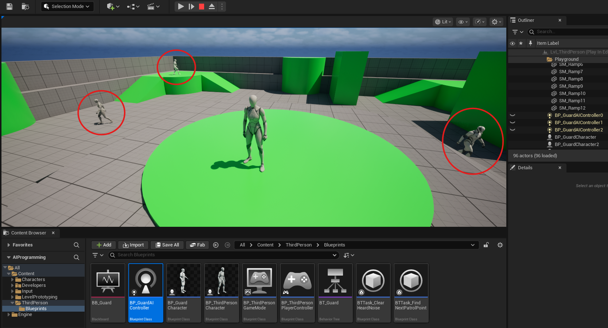
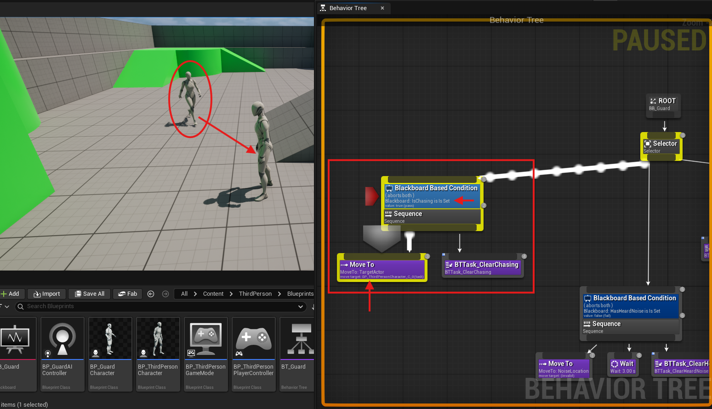

# 06 - Multiple Agents, Team Alertness, and Damage Perception

By this session your agent should be able to patrol, detects the player through sight and hearing, and switch between three behaviours. Now the scene needs more than one agent, those agents need to share information, and you have the option to add a third perception sense that responds to damage.

---

## Placing Multiple Agents

Place at least two additional instances of your guard character in the level. Each one gets its own Blackboard instance automatically: there is no shared state between agents by default. Each runs the same Behaviour Tree independently.

When you play, they will patrol separately, detect the player independently, and have no awareness of each other. This is the correct baseline to verify before adding coordination.

**Crowd avoidance** prevents agents from walking through each other. Enable **Use RVO Avoidance** on the CharacterMovement component of your character Blueprint. In Project Settings, find the Crowd Manager settings under AI System and ensure it is enabled. RVO (Reciprocal Velocity Obstacles) is Unreal's built-in local avoidance: each agent communicates its velocity to nearby agents and adjusts to avoid collisions. No code is required; enabling it is enough.



---

## Team Alertness

Independent agents produce a specific gameplay problem: a guard can be chasing the player three metres from another guard who remains completely oblivious. This is visually unconvincing and breaks the intended game feel.

Team alertness means: when one agent detects the player, other agents react. The implementation requires a mechanism for agents to share information, since by default each agent has its own private Blackboard.

There are several approaches. Choose the one that fits your project.

### Approach A: Game Instance (recommended for most projects)

The Game Instance is a Blueprint object that persists for the entire play session. It is accessible from any Blueprint anywhere in the game: AI Controllers, the player character, the level Blueprint, UI, everything. Storing a shared detection flag here makes it available to all agents without any direct references between them.

Create a Blueprint Class from the `GameInstance` parent class. Add a Boolean variable (`PlayerDetected`) and a Vector variable for the last known player location. In **Edit > Project Settings > Maps and Modes**, set your Game Instance Class to this Blueprint.

When one agent detects the player in its `OnTargetPerceptionUpdated` event, also write to the Game Instance. On the service running on each agent, read the Game Instance flag and update the local Blackboard accordingly. Each agent independently transitions to the appropriate branch on its next service tick.

### Approach B: Custom event broadcast

When one agent detects the player, get all AI Controllers of your guard type using **Get All Actors Of Class** and iterate through them, calling a custom event on each that updates their Blackboard. More explicit than the Game Instance approach, but requires iterating over all actors each time detection occurs.

### Approach C: Shared Blackboard

In the Behaviour Tree settings, there is an option to enable a shared Blackboard. All agents using that tree read from and write to the same Blackboard instance. Any write by one agent is immediately visible to all. This is elegant but requires careful key design: patrol-specific keys like the waypoint index will conflict across agents if shared.

Think about which approach fits your architecture before implementing. The Game Instance approach is the simplest to add to existing code without restructuring anything.

---

## What Team Alertness Should Look Like

The VG requirement specifies that when one agent detects the player, other agents must **visibly react**. An agent that continues patrolling normally while its neighbour is chasing the player does not satisfy this requirement.

A visible reaction could be:
- Switching from Patrol to the Investigate branch, moving toward the last known player location
- Switching to a dedicated Alert state that changes patrol speed or route
- Stopping in place and looking toward the alert location

The simplest implementation that satisfies the requirement: when the team alert fires, write the shared last known location to each agent's Blackboard `NoiseLocation` key and set `HasHeardNoise` to true. Each agent's existing Investigate branch handles the rest.

Test this by walking in front of one guard while another guard is clearly visible in frame. Both the guard that saw you and the one that did not should change behaviour within one service tick interval.


---

## AISense_Damage: A Third Perception Sense

Sight and hearing are the two senses required for VG. There is a third sense worth knowing about: **AISense_Damage**.

This sense fires when the agent takes damage. A guard that is shot from behind would never detect the player through sight or hearing, but should obviously react. Damage perception handles exactly this case.

Unlike sight and hearing, AISense_Damage does not require a Stimuli Source component on the player. It fires automatically when the agent receives damage through Unreal's standard damage system. The `OnTargetPerceptionUpdated` event receives the damage location as the Stimulus Location.

To add it:
- Add **AISense_Damage** to the Senses Config array on the AI Perception component, alongside sight and hearing
- In `OnTargetPerceptionUpdated`, add a third sense check using **Get Sense Class for Stimulus** compared to **AISense_Damage**
- On detection: set `IsChasing` to true and set `LastKnownPlayerLocation` to the Stimulus Location

To test it: apply damage to the guard from the player character using **Apply Damage** on a key press. The guard should react even from behind where sight cannot reach.

This sense is optional for the assignment but adds a layer of believability that is worth implementing if time allows.

---

## Second Agent Type

VG requires two distinct agent types with meaningfully different roles. If you have not started this yet, it is the priority after team alertness is working.

A distinct agent type means different behaviour, not just a different mesh. Consider what role the second agent serves in your game context and what that implies about its Behaviour Tree:

- Does it patrol? If so, does it patrol differently from the first type?
- Does it react to the player the same way, or differently?
- Does it move faster or slower, detect at shorter or longer range?
- Does it flee instead of chase? Investigate instead of attack?

The difference must be evident to someone watching your demo video who has not seen your code. If the two agents look like the same guard with different mesh colours, that does not satisfy the requirement.

---

## What to Have Working After This Session

- At least three agents in the scene, each running the tree independently
- RVO avoidance preventing them from occupying the same space
- Team alertness: when one agent detects the player, the others visibly react
- A plan for your second agent type, or a second agent type already implemented

After this session, you should have everything needed to meet both G and VG requirements.

---

## Commit Your Work

```bash
git add .
git commit -m "06 - Multiple agents and team alertness"
git push
```